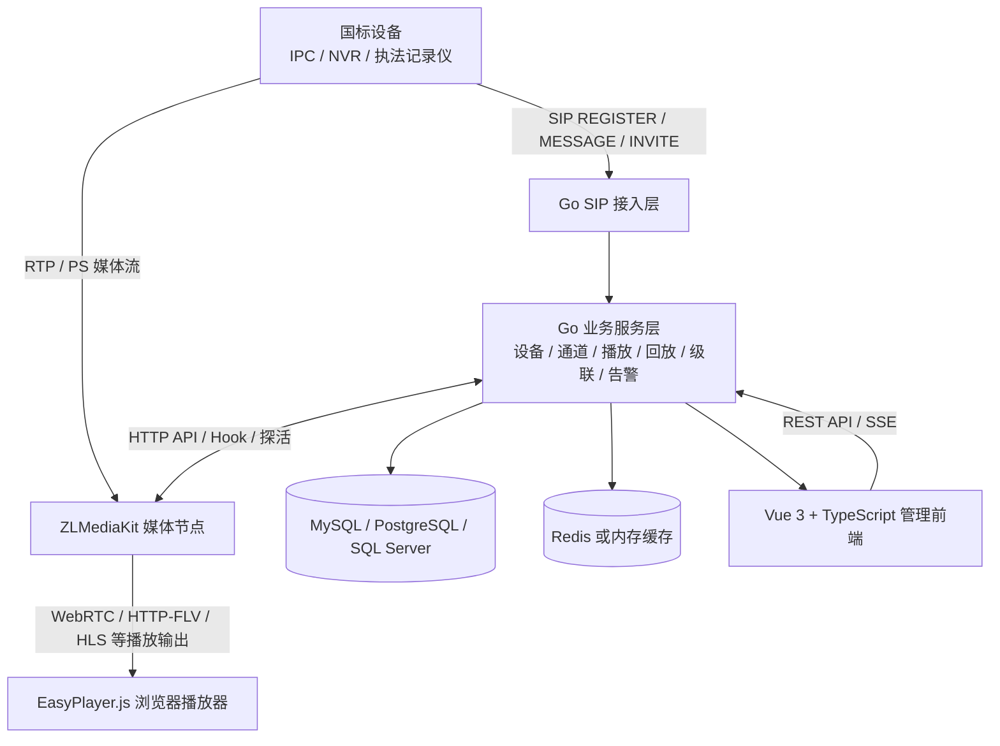

# UVP-GB28181

> **Unified Video Platform · 统一视频接入平台**
>
> 面向 GB/T 28181 视频接入场景的统一管理平台，让设备接入、媒体调度和问题排查都有迹可循。

UVP 是 **Unified Video Platform** 的缩写，中文全称为 **统一视频接入平台**。UVP-GB28181 是一套面向安防视频联网场景的统一视频接入与管理平台。项目采用 Go、Vue 3 和 TypeScript 构建，并集成 ZLMediaKit 提供媒体处理能力，目标是让国标设备接入更容易部署、更便于运维，也更容易定位问题。

## 项目亮点

- **面向真实现场问题设计**：围绕设备注册不上线、心跳掉线、信令成功但无画面、媒体卡顿、录像回放失败等常见问题，设计完整的状态记录和排查链路。
- **国标接入与媒体能力分层**：Go 后端负责 SIP 信令、GB/T 28181 协议处理、设备状态和业务编排，ZLMediaKit 负责媒体接入、转发、录制和协议输出，便于独立扩展与故障定位。
- **可观测、可追溯**：支持 SIP 报文和会话追踪、设备状态事件、媒体流生命周期、节点健康检查、流媒体探针、实时业务日志和安全事件查看，帮助定位问题发生在哪一层。
- **多媒体节点管理**：支持对多个 ZLMediaKit 节点进行接入、配置、探活、维护和运行监控，并提供轮询、加权和最小负载等调度策略。
- **设备与通道统一管理**：提供国标目录树、设备和通道管理、自定义分组、收藏、部门级数据隔离以及设备授权共享能力。
- **覆盖常用视频业务**：支持实时点播、录像检索与回放、云端录像、录像计划、多画面播放、云台控制、预置位、巡航、告警、移动位置和语音对讲等场景。
- **支持平台级联**：提供上级平台级联配置、目录共享和目录推送能力，适配跨平台的视频资源共享场景。
- **兼顾协议演进**：以 GB/T 28181-2016 兼容为基础，持续完善 GB/T 28181-2022 的版本识别、信令字段和设备能力适配；具体能力以设备支持情况和项目当前版本为准。
- **配套模拟器便于联调**：提供配套的国标设备模拟器，用于没有真实设备时的注册、目录、点播和协议问题复现。
- **部署路径清晰**：后端编译为 Go 程序，前端独立构建，数据库、缓存和媒体节点按职责拆分，适合开发联调、单机部署和按需扩展。

## 技术架构

UVP-GB28181 采用“信令控制面、业务管理面、媒体数据面分层”的架构。设备通过 SIP 与平台交互，媒体流由 ZLMediaKit 接收和处理，管理端通过 Web API 和浏览器播放器完成操作与预览。



### 各层职责

| 层次 | 主要职责 | 主要技术 |
| --- | --- | --- |
| 设备与协议层 | 设备注册、鉴权、心跳、目录、点播、回放、设备控制、告警和订阅等国标交互 | SIP、MANSCDP、SDP、RTP/PS、GB/T 28181-2016/2022 |
| 后端业务层 | 设备与通道管理、播放会话、录像计划、云端录像、级联、权限、安全和运维接口 | Go、Gin、GORM、Casbin、JWT、Swagger |
| 媒体数据层 | RTP 接收、媒体转发、录制、协议转换、流状态和节点运行能力 | ZLMediaKit、HTTP API、Hook |
| 数据与任务层 | 业务数据持久化、缓存、异步探针、调度记录和运行状态 | MySQL / PostgreSQL / SQL Server、Redis |
| 管理与播放层 | 管理页面、设备树、播放控制台、录像工作台、节点工作台和实时状态展示 | Vue 3、TypeScript、Vite、Arco Design、EasyPlayer.js |

### 一次实时点播的基本流程

1. 用户在管理前端选择设备或通道，后端校验权限并创建播放会话。
2. Go 信令与业务层通过 SIP 向设备发起点播请求，解析设备返回的 SDP，并为媒体会话选择可用的 ZLMediaKit 节点。
3. 设备按照协商结果向 ZLMediaKit 发送 RTP/PS 媒体流，ZLMediaKit 通过 Hook 和 API 将流状态反馈给平台。
4. 平台向前端返回可用的播放地址和会话状态，EasyPlayer.js 在浏览器中完成播放。
5. 如果播放失败，平台可以结合 SIP 会话、设备状态、媒体注册、流探针和节点状态逐层判断问题位置，而不是只显示一个笼统的播放失败。

### 可观测链路

平台将一次业务操作拆分为可以分别验证的环节：

```text
设备是否注册
  -> SIP 请求是否收到并通过鉴权
  -> 目录或点播信令是否完成
  -> SDP 与媒体地址是否有效
  -> RTP/PS 是否到达 ZLMediaKit
  -> ZLMediaKit 是否注册并持续输出媒体
  -> 浏览器播放器是否成功解码
```

这种分层方式既方便开发者调试协议，也方便运维人员在真实网络环境下区分设备、信令、媒体节点、网络和浏览器播放端的问题。

## 项目背景

### 来自一线的长期实践

我从事视频接入行业多年，也是一名长期奋战在项目一线的全栈开发者。过去这些年，我参与建设和运维的视频设备总量超过 8 万台，处理过局域网、公网、专网、NAT、跨网段和复杂防火墙策略下的各种接入问题，也见证了 GB/T 28181 从标准制定、行业推广到广泛落地的过程。

国标协议为不同厂商、不同类型的视频设备建立了一套共同的接入标准，但标准统一并不意味着实现完全一致。在实际项目中，不同厂商、型号和固件版本对协议的理解与支持程度仍然参差不齐。注册鉴权、心跳保活、目录订阅、设备控制、录像查询、SDP 协商和媒体传输等环节，都可能因为一个字段、一种编码方式或一个时序差异而表现出完全不同的问题。

这些问题往往不会出现在理想的测试环境里，却会集中暴露在真实项目现场：设备为什么注册不上来，为什么上线后又频繁掉线，为什么信令已经成功但始终没有画面，为什么同一条流有时正常、有时卡顿，为什么录像能查到却无法稳定回放。真正困难的通常不是把功能写出来，而是在成千上万台设备和复杂网络环境中，快速还原问题发生的过程，并找到可以验证的根因。

### 为什么重新做一个平台

目前国内成熟、活跃的开源 GB/T 28181 平台并不多，WVP 是其中应用较广、对行业贡献也非常重要的项目。我在使用 WVP 的过程中解决了许多实际问题，同时也逐渐形成了自己对设备接入、媒体节点管理、运行状态呈现和故障排查方式的理解。

随着项目规模扩大，我越来越希望拥有这样一套平台：它不仅能够完成设备接入和视频播放，还能把一次注册、一次点播、一段媒体会话以及一次异常掉线的前因后果完整地呈现出来；不仅告诉运维人员“失败了”，还要尽可能回答“失败在哪一步、依据是什么、下一步应该检查什么”。

这个想法在我心里酝酿了三年。经过长期的一线积累和反复取舍，我最终投入半年时间，将这些经验逐步沉淀为 UVP-GB28181。它不是为了重复实现已有功能，而是希望在协议兼容、部署体验、运行可观测性和问题追溯能力上，提供另一种更贴近现场运维的选择。

### 为什么选择 Go

我最熟悉的开发语言是 Java。最初规划这个项目时，继续使用 Java 是最直接、学习成本最低的选择。但经过较长时间的技术选型和原型验证，我认为 Go 更符合这个平台的目标：

- 编译后可生成独立程序，部署和升级路径更直接；
- 运行时资源占用相对可控，适合从小型现场到集中部署的不同环境；
- 对并发连接和网络 I/O 提供了简洁、成熟的语言级支持；
- 工具链统一，交叉编译方便，有利于降低多平台交付和运维成本；
- 代码结构相对直接，便于长期维护协议交互和状态机逻辑。

这不是对 Java 与 Go 的简单优劣判断，而是针对高频网络交互、长期连接、多协议协同和现场部署需求做出的工程选择。为此，我用了一年时间系统学习 Go、理解它的并发模型和工程实践，在具备足够把握之后才正式开始编写这个平台。

### 为可观测和可追溯而设计

长期运维 GB/T 28181 平台让我深刻体会到，很多问题真正缺少的不是又一个配置项，而是一条完整、可信的证据链。

因此，UVP-GB28181 从设计之初就把可观测性和可追溯性作为核心方向。平台不仅关注设备是否在线、视频是否能够播放，也关注 SIP 报文与会话过程、设备状态变化、媒体流生命周期、媒体节点健康状态、实时业务日志、安全事件以及异常发生前后的上下文。目标是让开发和运维人员能够沿着实际链路逐层判断：请求是否收到、信令是否成功、媒体是否注册、数据是否持续到达，以及最终播放端是否真正可用。

我希望它不仅是一套“能够接入设备”的平台，也是一套在设备规模扩大、网络环境变复杂之后，依然能够帮助团队理解系统正在发生什么的平台。

### 开源与配套工具

UVP-GB28181 采用宽松的 MIT License。无论个人还是企业，都可以在遵守许可证要求的前提下使用、修改、分发或用于商业项目。

项目同时提供配套的 GB/T 28181 设备模拟器，用于注册、目录、点播和协议交互等场景的开发联调与问题复现，降低没有真实设备时的测试门槛。平台和模拟器会持续围绕真实设备、真实网络和真实运维问题进行完善。

### 交流与合作

开源这个项目，也是希望借此认识更多从事视频监控、国标接入、流媒体和相关业务的同行。我愿意把这些年在设备接入、复杂网络、协议兼容和平台运维中积累的经验，逐步整理成可以复用的行业解决方案，与大家共同交流和完善。一个人的经历终究有限，只有让更多真实设备、真实场景和不同观点参与进来，平台才能持续解决更有价值的问题。

坦率地说，做这个项目也有一点自己的“私心”：我希望通过 UVP-GB28181，让更多人看到我在视频接入领域的专业能力和长期积累。如果你的团队有 GB/T 28181 平台二次开发、设备与协议适配、视频系统集成、私有化部署、疑难问题排查或其他软件开发需求，也欢迎与我交流合作。我希望能够用自己的专业经验，为项目提供真正可落地、可维护的技术服务。

当然，合作并不是交流的前提。即使彼此之间没有任何商业关系，我也很愿意结识来自五湖四海的行业朋友，交流业务场景、技术方案、踩坑经历和新的想法。开源带来的价值不应只有代码，也应该包括人与人之间真实、长期的连接。

## 致谢

UVP-GB28181 的诞生离不开行业内优秀项目和前辈们长期积累的成果。在此特别感谢以下项目及其开发者、维护者和社区贡献者。

### [ZLMediaKit](https://github.com/ZLMediaKit/ZLMediaKit)

感谢 ZLMediaKit 提供稳定、完整的流媒体服务能力。UVP-GB28181 以 ZLMediaKit 作为核心媒体能力底座，围绕它完成流媒体接入、分发、录制、协议转换、WebRTC 播放、Hook 回调以及媒体节点管理。ZLMediaKit 出色的性能、丰富的协议支持和持续演进的社区，为本项目节省了大量媒体层的重复建设工作。

### [WVP-GB28181-pro](https://github.com/648540858/wvp-GB28181-pro)

感谢 WVP-GB28181-pro 及其社区对国内 GB/T 28181 开源生态作出的重要贡献。WVP 让大量开发者能够更快地理解和落地国标设备接入，也为我早期处理设备注册、目录、点播、回放、级联及 ZLMediaKit 协同等问题提供了宝贵参考。UVP-GB28181 的形成，离不开长期使用 WVP 过程中获得的实践经验和启发。

### [EasyPlayer.js](https://github.com/EasyDarwin/EasyPlayer.js)

感谢 EasyDarwin 团队提供 EasyPlayer.js。它为浏览器端的视频直播与录像回放提供了多协议、多编码格式和多种解码路径的支持，降低了 H.264、H.265 等视频在不同浏览器环境中的播放适配成本，为 UVP-GB28181 的 Web 播放体验提供了重要支撑。

以上项目的名称、商标和版权归各自权利人所有。使用相关项目时，请遵守其各自的许可证和使用条款。
